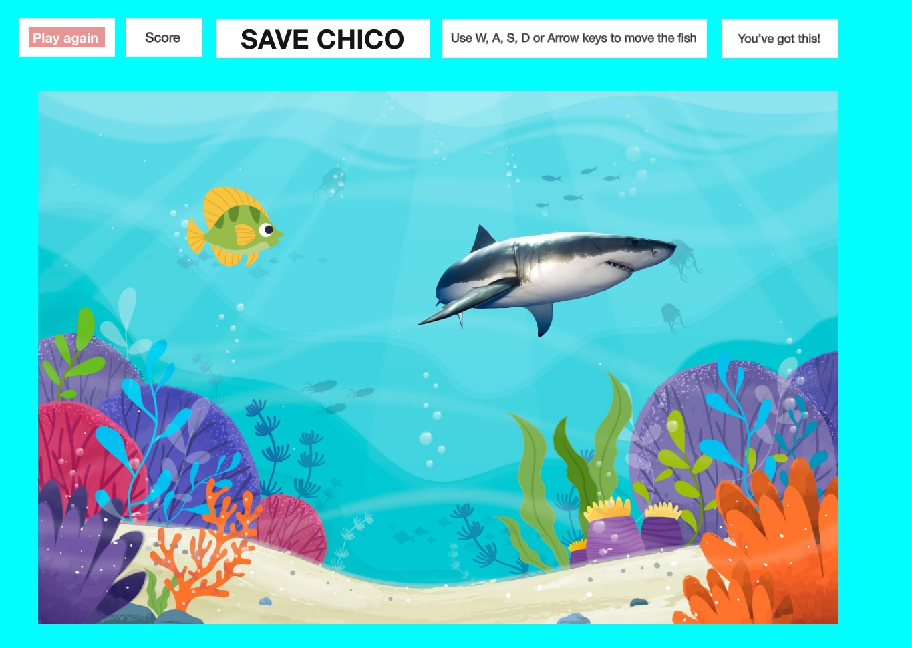
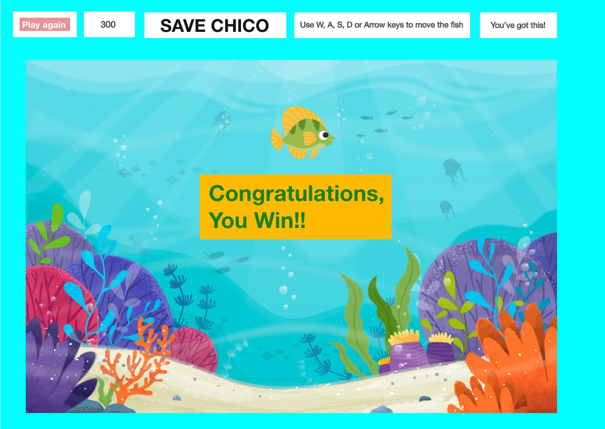
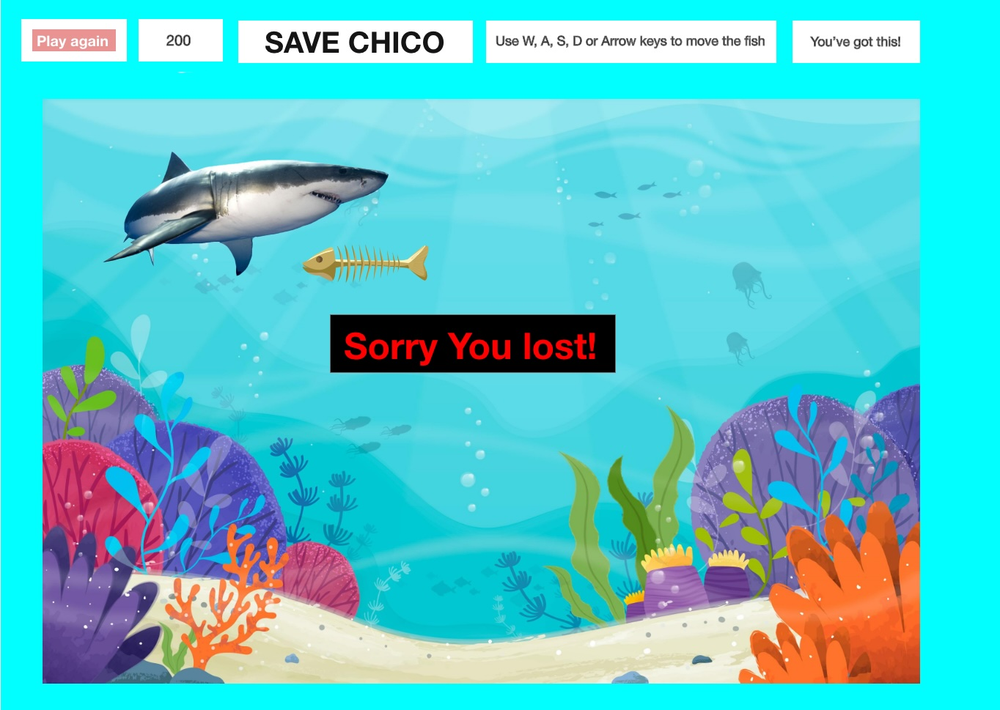
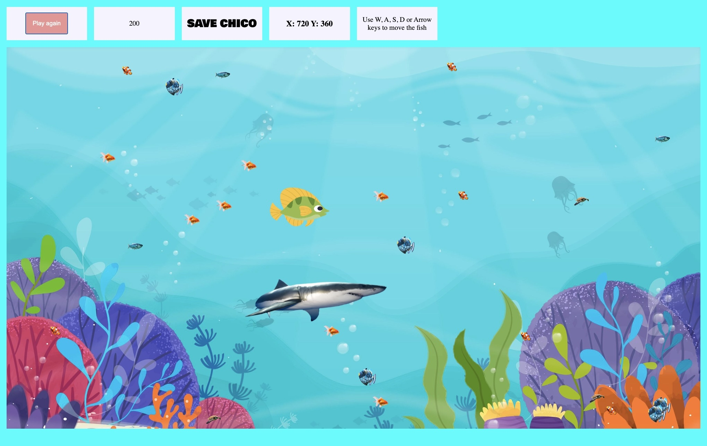

# Save Chico the fish 🐠 from the hungry shark! 🦈

### A fun javascript game 😃



## Technologies used

HTML, CSS, and JavaScript
q
## Steps to install on local computer

`Fork` and `clone` the repository
https://github.com/AlejandraValdivia/save-chico-the-fish to your computer and run the following command in the terminal:

`open index.html`

and view the game in the browser.

## Game Instructions

Help our friend Chico escape the hungry shark before he eats him!

Use `W`, `S`, `A`, `D` keys and or `Arrow keys` to swim through the game.

If you score 300 points or higher and scaped the shark, You Win!!


Otherwise, if the shark gets 🦈 you.. You die! :(


### Save chico the fish game screenshot



## Unresolved problems

Making the game longer and more complicated to win including levels of complexity and speed.

I was not able to find free sound effects to include in the game.

## Code Snippets

Game loop

```javascript
function gameLoop() {
  ctx.clearRect(0, 0, game.width, game.height);
  movement.textContent = `X: ${chicoCharacter.x}\nY: ${chicoCharacter.y}`;
  if (chicoCharacter.x >= game.width - chicoCharacter.width) {
    newScore = Number(score.textContent) + 100;
    score.textContent = newScore;
    chicoCharacter.x = 0;
    sharkInterval -= 2000;
    shark.x += 100;
  }
  if (newScore === 300) {
    winGame();
  }
  if (Date.now() - previousSharkTime > sharkInterval) {
    addNewShark();
    previousSharkTime = Date.now();
    sharkInterval += 1000;
  }
  if (shark.alive) {
    shark.x += 5;
    shark.render();
    let hit = detectHit(chicoCharacter, shark);
  }
  chicoCharacter.render();
}
```

Code snippet to display fish swimming around randomly

```javascript
let swimmingFishArray = [];

function addFishAround() {
  setTimeout(() => {
    const fishImages = [
      "img/—Pngtree—yellow fish isolated on white_9144140.png",
      "img/10582592.png",
      "img/10582595.png",
      "img/10582611.png",
      "img/fishing-png-41470.png",
      "img/10717802.png",
    ];
    const randomImageIndex = Math.floor(Math.random() * fishImages.length);
    const randomFishImage = new Image();
    randomFishImage.src = fishImages[randomImageIndex];

    randomFishImage.onload = function () {
      const newFish = new Character(
        Math.random() * game.width,
        Math.random() * game.height,
        randomFishImage,
        50,
        50
      );
      swimmingFishArray.push(newFish);
    };
  }, 2000);
}
```

Code snippet of the hungry shark 🦈 popping out chasing chico

```javascript
function addNewShark() {
  shark.alive = false;
  setTimeout(function () {
    let randomX = Math.floor(Math.random() * game.width - 50);
    let randomY = Math.floor(Math.random() * game.height - 90);
    const colors = [
      "yellow",
      "purple",
      "cyan",
      "gold",
      "blue",
      "peru",
      "red",
      "green",
    ];
    let randomIndex = Math.floor(Math.random() * colors.length - 1);
    let randomColor = colors[randomIndex];
    shark = new Character(randomX, randomY, sharkImg, 200, 420);
  }, 1000);

  return true;
}
```

## Future Additions

More levels of complexity and speed

Choices of fish character images

Sound effects

### Visit the page that hosts my game in GitHub to get started playing! Have fun!!

[http:https://alejandravaldivia.github.io/save-chico-the-fish/](https://alejandravaldivia.github.io/save-chico-the-fish/)
