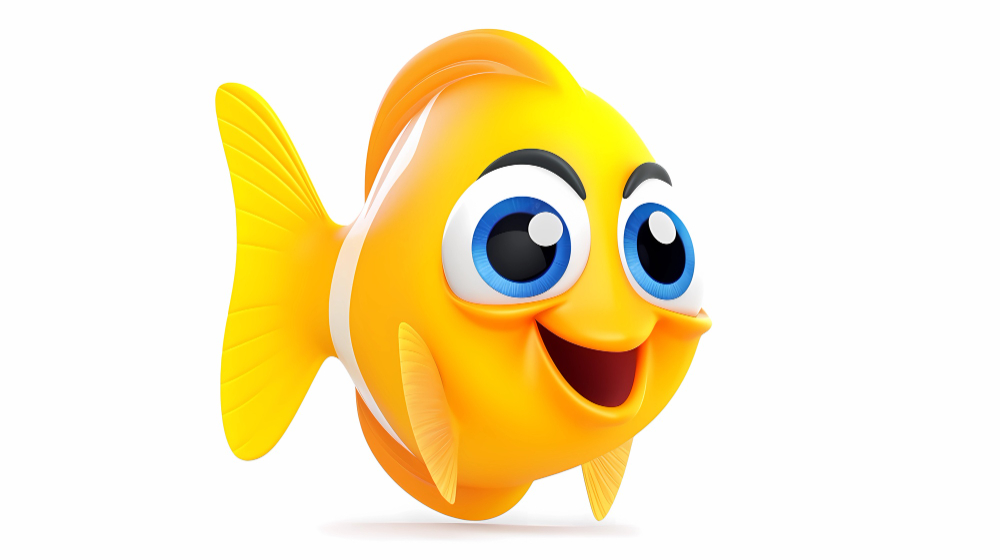
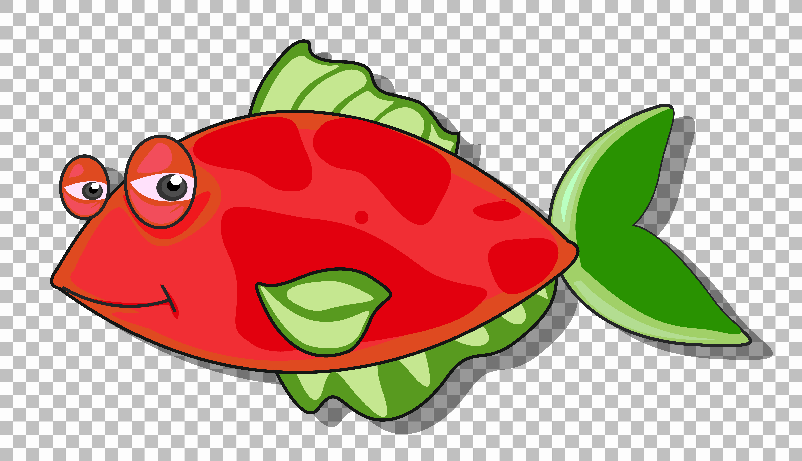

# Save Chico the fish 🐠 #

### A simple and fun javascript game  😃 ###


## Technologies used ##
**HTML, CSS, and JavaScript, AdobeXD**

## Installation instructions ##
### Fork and clone the repository https://github.com/AlejandraValdivia/save-chico-the-fish to your computer and run the following command in the terminal:  
**open index.html**
### and view the game in the browser ###

### Help our friend Chico escape the hungry shark before he eats him!

### Use W, S, A, D keys and Arrow keys to swim through the game

### If you score 300 points or higher, You Win!!

### Otherwise, if the shark gets 🦈 you.. You die! :(

### Save chico the fish game screenshot ###


## Unresolved problems ##
### Game is not able to restart. Game shows win/loss message after hitting "play again" button ###
### Making the game longer and more complicated to win including levels of complexity and speed ###
```javascript
function gameLoop() {
  ctx.clearRect(0, 0, game.width, game.height);
  movement.textContent = `X: ${chicoCharacter.x}\nY: ${chicoCharacter.y}`;
  if (chicoCharacter.x >= game.width - chicoCharacter.width) {
    newScore = Number(score.textContent) + 100;
    score.textContent = newScore;
    chicoCharacter.x = 0;
    sharkInterval -= 2000;
    shark.x += 100;
  }
  if (newScore === 300) {
    winGame();
  }
  if (Date.now() - previousSharkTime > sharkInterval) {
    addNewShark();
    previousSharkTime = Date.now();
    sharkInterval += 1000;
  }
  if (shark.alive) {
    shark.x += 5;
    shark.render();
    let hit = detectHit(chicoCharacter, shark);
  }
  chicoCharacter.render();
}
```
### Code snipet to include 2 sharks 🦈🦈 popping out chasing chico ###
```javascript
function addNewShark() {
  shark.alive = false;
  setTimeout(function () {
    let randomX = Math.floor(Math.random() * game.width - 50);
    let randomY = Math.floor(Math.random() * game.height - 90);
    const colors = [
      "yellow",
      "purple",
      "cyan",
      "gold",
      "blue",
      "peru",
      "red",
      "green",
    ];
    let randomIndex = Math.floor(Math.random() * colors.length - 1);
    let randomColor = colors[randomIndex];
    shark = new Character(randomX, randomY, sharkImg, 200, 420);
  }, 1000);

  return true;
}

twoSharks = new Character(200, 300, twoSharksImg, 300, 300);
```

### I was not able to find free sound effects to include in the game ##
### I was unable to include a list of fish images that you can use to pick your fish character ###



## Future Additions ##
### More levels of complexity and speed ###
### Choices of fish character images ###
### Sound effects ###
### Win/loss message will disappear when you hit "play again" button" or restart game without refreshing the browser ###

### Visit the page that hosts my game in GitHub to get started playing! Have fun!! ###
 [http:https://alejandravaldivia.github.io/save-chico-the-fish/](https://alejandravaldivia.github.io/save-chico-the-fish/)